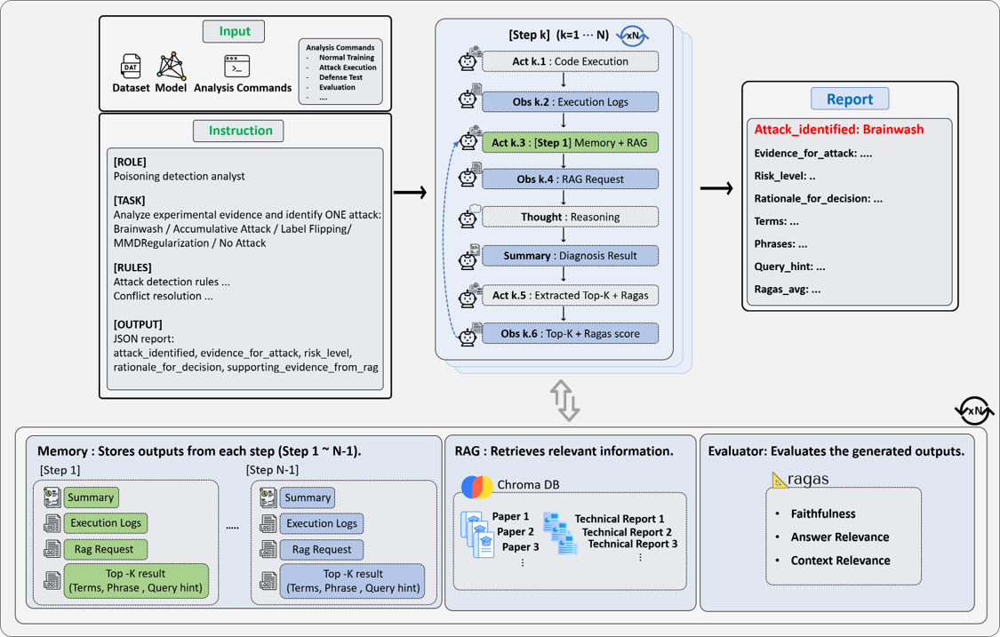

# TRACER

**Temporal Retrieval-Augmented Contextual Evaluator for Robustness in ML Training**

Official implementation of the paper *TRACER: Temporal Retrieval-Augmented Contextual Evaluator for
Robustness in ML Training* — Junseok Shin, Jinhyeok Jang, Sohee Park, Jinwoo Lee, Daeseon Choi
(AI Safety Center, Soongsil University). *Preprint submitted to Elsevier.*

TRACER is an LLM-agent framework that **orchestrates ML data-poisoning / backdoor / adversarial
attack pipelines, reads their execution logs, and decides *which attack occurred* (if any).**
Each step is summarized with a memory-carrying LLM chain, grounded against a RAG knowledge base
of security papers, scored with RAGAS-style metrics, and the most salient terms are extracted and
**injected into the next step's retrieval query** (the "temporal" feedback loop). It is a
**complement to** — not a replacement for — attack-execution / robustness tools (e.g., ART,
Counterfit), adding temporal interpretation and evidence-grounded explanation on top of their
numerical outputs.

---

## How it works

<p align="center">
  
</p>

<p align="center">
  <em>
    TRACER sequentially executes attack pipelines, analyzes execution logs
    using accumulated memory and retrieved knowledge, evaluates diagnostic
    reliability, and injects semantic Top-K clues into the next analysis step.
  </em>
</p>

Four core modules (`src/Tracer_Agent.py`): **Semantic Top-K clue extraction** (refines the retrieval
query each step), **Memory management** (LangChain file-based, per-session), **Knowledge retrieval /
RAG** (ChromaDB, `text-embedding-3-large`, 1000-token chunks / 200-token overlap), and **Reliability
evaluation** (Ragas: Faithfulness, Answer Relevance, Context Relevance). Default reasoning engine:
GPT-5 (OpenAI API); the paper also evaluates a GPT-4.1 variant.

---

## Threat scenarios & datasets

The paper evaluates TRACER on four training-phase threat scenarios. The agent decides among
**Brainwash / Accumulative Attack / Label Flipping / MMDRegularization / No Attack**, with a risk
level of 1–5.

| Scenario | Reference implementation | CLI choice(s) | Datasets | Diagnostic signature |
|----------|--------------------------|---------------|----------|----------------------|
| **Brainwash** (continual learning) | [mint-vu/Brainwash](https://github.com/mint-vu/Brainwash) | `Brainwash`, `brainwash_cifar10`, `brainwash_miniimagenet`, `brainwash_tinyimagenet` | CIFAR-100, CIFAR-10, Mini-ImageNet, Tiny-ImageNet | selective forgetting: prior tasks drop while the last task remains high |
| **Accumulative Poisoning** | [ShawnXYang/AccumulativeAttack](https://github.com/ShawnXYang/AccumulativeAttack) | `Accumulative`, `accumulative_cifar100` | CIFAR-10, CIFAR-100 | delayed global collapse: performance remains stable until a trigger causes an abrupt drop |
| **Label Flipping** (GNN) | [VijayLingam95/RethinkingLabelPoisoningForGNNs](https://github.com/VijayLingam95/RethinkingLabelPoisoningForGNNs) | `Rethink`, `Rethink_pub` | Citeseer (GCN) | test accuracy decreases monotonically as the poisoning budget increases |
| **Label Error** (detection) | [snu-mllab/Neural-Relation-Graph](https://github.com/snu-mllab/Neural-Relation-Graph) | `Detect` | Tiny ImageNet with 8% label noise | label-error detection using ROC-AUC, AP, and TNR@95 |

> [!NOTE]
> These external repositories provide the original or reference implementations used to construct
> the evaluated attack and detection pipelines. They are not included in this repository and must
> be downloaded and configured separately.

`src/attack_spec.py` also includes additional pipeline builders beyond the paper's four main
evaluation scenarios:

- `MMD_backdoor`
- `MMD_backdoor_cifar100`
- `FGSM`
- `PGD`
- `PhysPatch`

These additional builders are provided for extended experiments and are not part of the paper's
primary four-scenario evaluation.

## Repository layout

```
TRACER/
├── assets/                  # README figures (e.g. tracer_workflow.png)
├── src/
│   ├── Tracer_Agent.py      # main entry point (interactive CLI)
│   ├── attack_spec.py       # LOG_DIR + StepSpec + all build_*_specs() (attack pipeline definitions)
│   ├── detection_prompt.py  # DETECTION_SYSTEM_PROMPT (LLM system prompt)
│   └── ablation/            # ablation & sensitivity variants (paper Section 5)
├── rag/
│   ├── ingest.py            # build the ChromaDB "papers" collection from PDFs
│   ├── utils.py             # PDF extract + token chunking + OpenAI embedding helpers
│   └── chromacheck.py       # inspect the collection
├── logs/                    # runtime output (git-ignored) — see "Outputs" below
├── requirements.txt
├── .env.example
└── README.md
```

---

## Setup

### 1. Install
```bash
pip install -r requirements.txt
```

### 2. API key
```bash
cp .env.example .env      # then edit, or just:
export OPENAI_API_KEY="sk-..."
```

### 3. Start the ChromaDB server (required for RAG)
The agent connects to a Chroma HTTP server at `127.0.0.1:8000`:
```bash
chroma run --host 127.0.0.1 --port 8000 --path ./chroma_db
```

### 4. Build the RAG knowledge base
Source papers are **not** shipped in this repo (copyright). Download the PDFs listed in
[`rag/ingest.py`](rag/ingest.py) — BrainWash (CVPR'24), Accumulative Poisoning (NeurIPS'21),
Multi-Level MMD Regularization, Neural Relation Graph, Rethinking Label Poisoning for GNNs,
"Explaining and Harnessing Adversarial Examples", PGD (Madry et al.), PhysPatch — place them under
`./papers/`, then:
```bash
python rag/ingest.py       # extracts, chunks (1000-tok / 200 overlap), embeds → "papers" collection
python rag/chromacheck.py  # sanity check
```

---

## ⚠️ External attack implementations (must be provided separately)

TRACER is an **orchestrator**. The commands built in `src/attack_spec.py` invoke separate attack
codebases, whose paths are written as `/path/to/...` placeholders, e.g.:

```
/path/to/Brainwash/                          (main_baselines.py, main_inv.py, main_brainwash.py)
/path/to/PoisoningAttack/AccumulativeAttack/ (train_cifar.py, online_accu_train.py)
/path/to/Multi-Level-MMD-Regularization/
/path/to/Detect/ , /path/to/2nd/evasion/     (Neural Relation Graph, FGSM/PGD/PhysPatch)
```

These projects, their datasets, and their model checkpoints (`.pkl`, hundreds of MB) are **not**
part of this repository. Before running the orchestration paths you must:

1. Provide those attack projects locally, **and**
2. Replace every `/path/to/...` (and adjust `CUDA_VISIBLE_DEVICES` / `LOG_DIR` / `BASE_DIR`) in
   `src/attack_spec.py` to match your machine.

The `Analysis` paths (below) only need the step logs, so they can be run without re-executing attacks.

---

## Running

```bash
cd src
python Tracer_Agent.py
# prompt: which program?
#   Brainwash / brainwash_cifar10 / brainwash_miniimagenet / brainwash_tinyimagenet   (continual learning)
#   Accumulative / accumulative_cifar100                                              (accumulative poisoning)
#   Rethink / Rethink_pub                                                             (GNN label flipping)
#   Detect                                                                            (label-error detection)
#   MMD_backdoor / MMD_backdoor_cifar100 / FGSM / PGD / PhysPatch                      (additional builders)
#   Analysis / Analysis_Accumulative   ← analyze existing logs only (no attack re-run)
```

Each step writes a structured JSON report: identified attack, supporting evidence, risk level,
rationale, RAG support, the extracted Top-K terms/phrases/query-hint, and average Ragas scores.

---

## Ablation & sensitivity studies (paper Section 5)

The variants in `src/ablation/` (plus environment toggles) reproduce the paper's ablations. They
import `attack_spec` / `detection_prompt`, so run them with `src` on the path:

```bash
# --- component ablations ---
USE_RAG=0  python src/Tracer_Agent.py                       # No RAG   (retrieval disabled)
PYTHONPATH=src python src/ablation/Agent_without_memory.py   # No Memory
PYTHONPATH=src python src/ablation/Agent_without_topk.py     # No Top-K

# --- sensitivity analyses ---
TOPK_K=1 PYTHONPATH=src python src/ablation/topk_sweep_runner.py   # Top-K sweep: K ∈ {1, 3, 5}; K=5 is the default
PYTHONPATH=src python src/ablation/Agent_GPT4.1.py                 # GPT-4.1 model variant
PYTHONPATH=src python src/ablation/Agent_without_instruct.py       # prompt / instruction variant

# --- aggregate results ---
python src/ablation/ablation_extract.py
python src/ablation/ablation_compare.py
```
> Paper finding: the **full** configuration (memory + Top-K + RAG) is the most stable (no FP/FN/
> mismatch across scenarios). Removing **RAG** raises false negatives on intermediate Brainwash
> stages; removing **Memory** causes attack-family confusion; too-small **Top-K** (K=1/3) increases
> false negatives, so **K=5** is the default.
>
> `ablation_extract.py` / `ablation_compare.py` read result dirs (`./results/*`) produced by the
> runs — adjust those paths for your setup.

---

## Outputs

Everything is written under `LOG_DIR` (default `./logs`, set in `src/attack_spec.py`) and is
**git-ignored**:

| Path | Contents |
|------|----------|
| `logs/*.log` | raw stdout/stderr of each attack step (`step1.log`, `mini_step*.log`, …) |
| `logs/memory/<session>.json` | LangChain per-session summary memory |
| `logs/LLM_topk/*.json` | extracted Top-K terms + next-step injection records |
| `logs/vision/*.json` | GPT-vision analysis of figures |
| `logs/monitor_summary_<tag>_step*.json` | per-step reports |
| `logs/monitor_summary_<tag>.json`, `logs/analysis*.json` | final aggregated reports |

---

## Reliability evaluation (Ragas)

Each report is scored in `[0, 1]` on **Faithfulness** (grounded in retrieved context?),
**Answer Relevance** (addresses the diagnostic query?), and **Context Relevance** (is the retrieved
context useful?). Interpretation (paper Section 3.2): **> 0.80** strong, **0.60–0.80** moderate,
**< 0.60** weak grounding — complementary reliability indicators, not pass/fail correctness labels.

---

## Environment variables

| Var | Default | Meaning |
|-----|---------|---------|
| `OPENAI_API_KEY` | — | required (falls back to `OPENAI_APIKEY`) |
| `USE_RAG` | `1` | query ChromaDB for evidence |
| `USE_TOPK` | `1` | extract Top-K and inject into next step |
| `USE_VISION` | `1` | analyze figure PNGs with GPT vision |
| `TOPK_K` | `5` | number of Top-K terms/phrases (K=5 is the paper's default) |
| `LOG_TAIL` | `20000` | chars of log tail sent to the LLM |
| `RAGAS_EMBED_MODEL` | `text-embedding-3-small` | embedding model for Ragas answer-relevance |

---

## Experimental environment (paper)

Linux · Intel Xeon Silver 4410Y · NVIDIA RTX A5000 (24 GB VRAM) · CUDA 12.8 · GPT-5 API as the core
reasoning engine (GPT-4.1 additionally evaluated).

---

## Citation

```bibtex
@article{shin2026tracer,
  title   = {{TRACER}: Temporal Retrieval-Augmented Contextual Evaluator for Robustness in {ML} Training},
  author  = {Shin, Junseok and Jang, Jinhyeok and Park, Sohee and Lee, Jinwoo and Choi, Daeseon},
  year    = {2026},
  note    = {Preprint submitted to Elsevier}
}
```

## Acknowledgement

This work was supported by the Institute of Information & Communications Technology Planning &
Evaluation (IITP) grant funded by the Korean government (MSIT) (No. RS-2025-02215344, *Development of
Artificial Intelligence Technology with Robustness and Flexible Resilience Against Risk Factors*).
